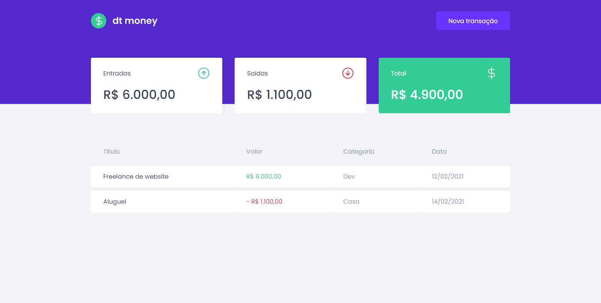
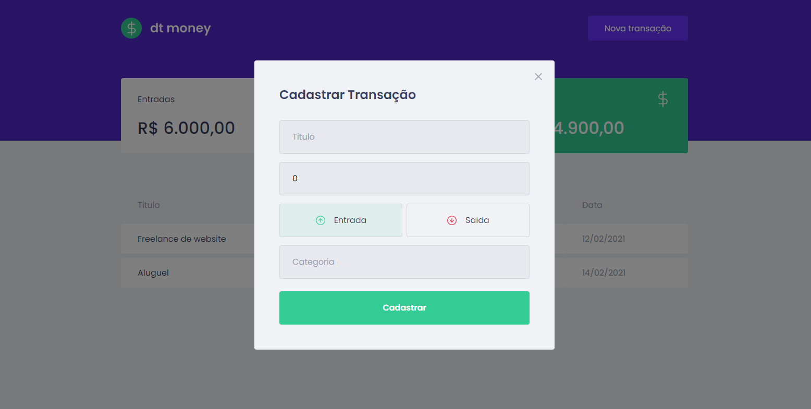
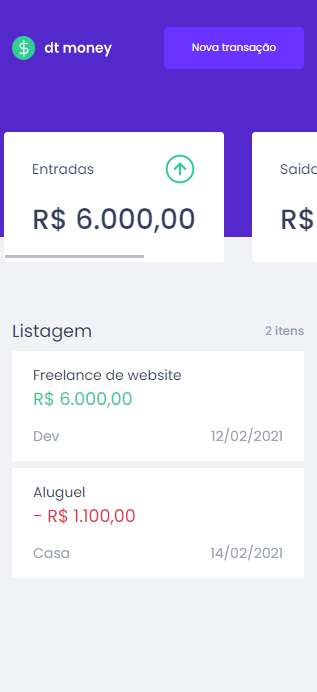
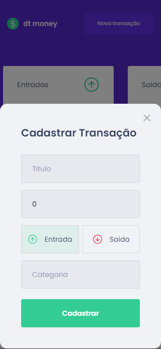

<p align="center">
  
</p>

# Sobre o projeto
  dtMoney é um projeto que simula transações de entrada e saida de uma conta. Foi desenvolvido no curso Ignite.  

# Layout web
<p align="center">
  
  
</p>

# Layout mobile
<p align="center">
  
  
</p>

# 🛠 Tecnologias
As seguintes ferramentas foram usadas na construção do projeto:

### front-end

- [ReactJs](https://pt-br.reactjs.org)
- [Typescrypt](https://www.typescriptlang.org)
- [axios](https://www.npmjs.com/package/axios)
- [framer-motion](https://www.npmjs.com/package/framer-motion)
- [polished](https://www.npmjs.com/package/polished)

### back-end
- [miragejs](https://miragejs.com)


# Back-End
O back-end foi construído em usando miragejs(Mock backend) seguindo os seguintes caminhos:
* /api
  * /transactions(get) - lista todas as transações
  * /transactions(post) - cadastra uma transação

# 🚀 Como executar o projeto

💡 Como o back-end está em miragejs não é necessário executar nenhuma configuração separada para ele.

## Pré-requisitos
Antes de começar, você vai precisar ter instalado em sua máquina as seguintes ferramentas:

 * [Git](https://git-scm.com)
 * [Node.js](https://nodejs.org)
 * [VSCode](https://code.visualstudio.com) ou outro editor de codigos

## 🧭 Rodando a aplicação

⚠️ Quando clonar a aplicação não se esqueça de:
 - Criar url de conexão para banco de dados em .env
 - Criar um segredo para o jwt em secrets/jwt.json

```bash
# Clone este repositório
$ git clone https://github.com/Leandro-Goncalves/dtmoney

# Acesse a pasta do projeto no seu terminal/cmd
$ cd dtmoney

# Instale as dependências
$ npm install
# ou
$ yarn

# Execute a aplicação em modo de desenvolvimento
$ npm run start
# ou
$ yarn start

# A aplicação será aberta na porta:3000 - acesse http://localhost:3000
```
---

# Author
Feito com ❤️ por Leandro Gonçalves [Entre em contato!](mailto:leandrogoncalvesprofissional@hotmail.com)

<a href="https://github.com/Leandro-Goncalves/">
  
 <br />
 <sub><b>Leandro Gonçalves</b></sub></a>

---